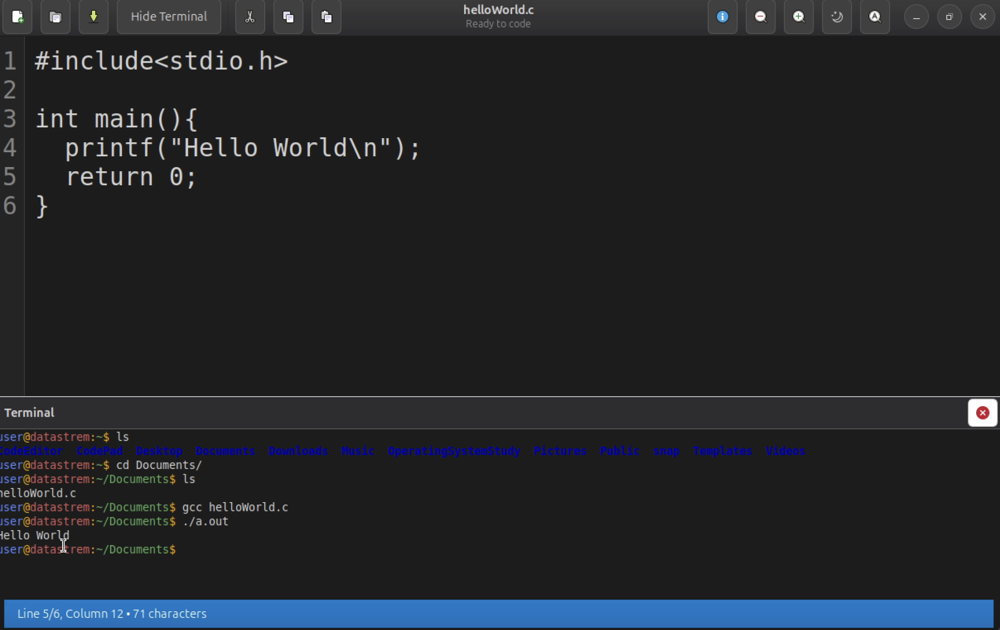
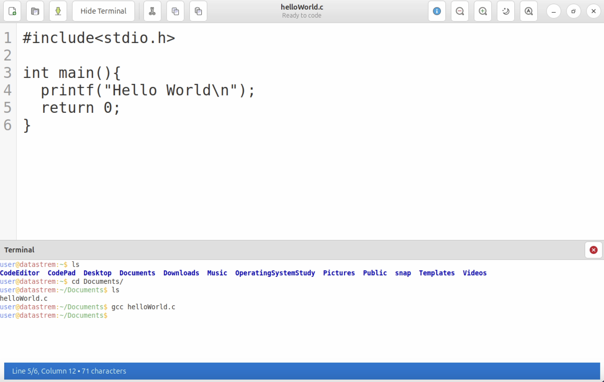
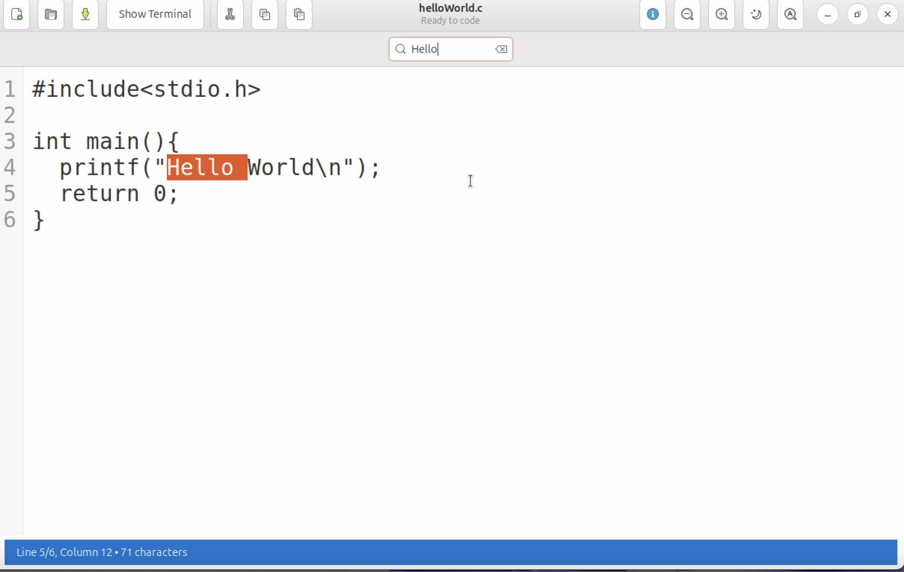

# CodePad - Code Editor with Integrated Terminal


A beautiful, modern code editor with integrated terminal emulator built with GTK+ 3 and VTE terminal library.

##  Motivation

CodePad was born out of boredom during my first year, second semester at university while enrolled in the **Data Structures in C** course. Initially, I was working on console-based projects like a train management system with menu-driven interfaces. However, I wanted to explore GUI development and create something more visually appealing and functional.

The idea struck me when I realized how often I was switching between my text editor and terminal while coding. Why not combine both into a single, elegant application? This project became my gateway into GUI programming with GTK+ and taught me valuable lessons about creating desktop applications in C.

What started as a learning exercise evolved into a fully-featured code editor.

## Features

### **Modern User Interface**
- **Dark & Light Themes**: Toggle between beautiful dark and light themes with a single click
- **Modern Header Bar**: Clean, modern interface with intuitive button placement
- **Customizable Font Sizing**: Zoom in/out functionality for better readability
- **Line Numbers**: Built-in line number display for easier code navigation
- **Status Bar**: Real-time information about cursor position, line count, and character count

### **Text Editing Capabilities**
- **File Operations**: Create, open, save, and save-as functionality
- **Cut, Copy, Paste**: Standard text editing operations with keyboard shortcuts
- **Search Functionality**: Built-in search bar with live text highlighting
- **Auto-Save Prompts**: Smart prompts to prevent data loss

###  **Integrated Terminal**
- **Full Terminal Emulation**: Powered by VTE (Virtual Terminal Emulator)
- **Shell Compatibility**: Works with bash, zsh, sh, and other common shells
- **Resizable Interface**: Adjustable paned layout between editor and terminal
- **Smart Directory Navigation**: Terminal automatically navigates to opened file's directory
- **Show/Hide Toggle**: Easy terminal visibility control

###  **Keyboard Shortcuts**
- `Ctrl+N` - New file
- `Ctrl+O` - Open file
- `Ctrl+S` - Save file
- `Ctrl+Q` - Quit application
- `Ctrl+X/C/V` - Cut/Copy/Paste
- `Ctrl+F` - Find text
- `Ctrl+T` - Toggle terminal
- `Ctrl++/-` - Zoom in/out

### **File Format Support**
- **Source Code**: C, C++, Python, JavaScript, HTML, CSS, Java
- **Text Files**: TXT, Markdown
- **Universal**: All file types supported

## Technical Foundation

### GTK+ (GIMP Toolkit)
CodePad is built using **GTK+ 3**, a cross-platform widget toolkit for creating graphical user interfaces. GTK+ provides the foundation for our modern UI components, theming system, and event handling.

**Learn more about GTK+**: [GTK Documentation](https://docs.gtk.org/gtk3/) | [Wikipedia](https://en.wikipedia.org/wiki/GTK)

### VTE (Virtual Terminal Emulator)
The integrated terminal functionality is powered by **VTE**, a terminal emulator widget for GTK+. VTE provides full terminal emulation capabilities, including:
- ANSI color support
- Shell integration
- Scrollback buffer
- Mouse interaction
- Copy/paste functionality

**Learn more about VTE**: [VTE Documentation](https://lazka.github.io/pgi-docs/Vte-2.91/) | [GNOME](https://gitlab.gnome.org/GNOME/vte)

##  Demo

### Video Demo  
[](https://youtube.com/watch?v=XuBntZEpBrU)


*Click the image above to watch the full demo on YouTube*

### Screenshots

#### Dark Theme Interface

*CodePad in dark theme showing the integrated terminal*

#### Light Theme Interface

*Clean light theme perfect for daytime coding*

#### Search Functionality

*Live search with text highlighting*

##  Installation

```bash
# Ubuntu
sudo apt-get install libgtk-3-dev libvte-2.91-dev build-essential

# Mac
brew install gtk+3 vte3

#Windows
pacman -Syu
pacman -S mingw-w64-x86_64-gcc mingw-w64-x86_64-gtk3 mingw-w64-x86_64-vte3 pkg-config

### Building from Source
```bash
# Clone the repository
git clone https://github.com/AdilMulimani/CodePad.git
cd CodePad

# Compile
gcc -o code-editor main.c editor.c terminal.c ui.c callbacks.c `pkg-config --cflags --libs gtk+-3.0 vte-2.91`

# Run
./codepad
```
